# Benchmarking Normalization Algorithms

## Table of Contents

1. [Test Framework](#Framework)
1. [Normalizers](#Normalizers)
1. [Benchmarks](#Benchmarks)
1. [Results](#Results)
1. [Personal Conclusion](#Conclusion)
1. [References](#References)

## Framework

Lambda terms are represented using de Bruijn index.
Time used to normalize a term is measured.
Some algorithms may use an alternative term representation.
In this case, the time used to convert between different term representations
is not counted.
Note that intermediate data structure like values in NBE
does not count as an alternative term representation
because they cannot be examined.

In the future, maybe the time needed to test conversion directly
on the algorithm's internal rep. may be added.

The definition of syntax and common data structures lies in `Common`.

The `bench.ml` executable can be used to run the various test benches.
You should provide it with the name of normalizer,
the name of benchmark and size parameter to the benchmark.

To exclude the effect of previous runs on GC,
every test run should be executed with a fresh process.
This is done through the `bench.sh` script.
It also handles timeout of benchmarks.

Since there are a lot of normalizer variants,
and different normalizers may have very diversed performance on different benchmarks,
not all normalizers are tested and compared together.
Instead, normalizers are tested in various different combinations,
each comparing one aspect of different normalizers.
The `NBE.closure.list` normalizer is used as a reference baseline in
all combinations.
Also, different combinations are tested using exactly the same terms
in the same environment, except for the `random` benchmark,
where the fresh random terms are generated for each combination.

## Normalizers

Various normalization algorithms sit in `Normalizers`.
You can find more detailed explanation in the [Conclusion](#Conclusion).

- `subst.naive` (in `Subst.ml`):
naive normal-order capture-avoiding substitution
- `subst.whead` (in `Subst.ml`):
capture-avoiding substitution, but reduce redex only to weak head first
before substitution.
- `NBE.HOAS.X` (in `NBE_HOAS.ml`):
Normalization By Evaluation (NBE), using HOAS to represent closures.
`X` is the data structure used to implement the environment,
which includes:
  - `list`: plain list
  - `tree`: `Map` in OCaml's standard library (AVL tree)
  - `skew`: skew binary random access list from Chris Okasaki's
  Purely Functional Data structure [[9]](#9)
- `NBE.closure.list|tree` (in `NBE_Closure.ml`):
NBE, using raw lambda terms to represent closures.
Come with two flavors of environment data structure too
- `NBE.named.list|tree|ADT` (in `NBE_Named.ml`):
NBE, but using a named term representation instead of de Brujin index.
Uses a global counter for fresh variable generation.
Environment is represented as association list,
OCaml's AVL tree (`Map`),
or a specialized ADT with the pairs in association list inlined.
- `NBE.memo.v1|v2|v3|v4` (in `NBE_Memo.ml`)
Same as `NBE.closure.list`,
but each value memorizes the term it quotes back to (at some level).
There's only one memorization slot, to reduce constant overhead.
`v1`, `v2` and `v3` uses three different ways to store the extra memorization slot.
`v1` uses a fat pointer storing a mutable `(level * term) option`,
`v2` also uses fat pointer, but uses two separate mutable slots
for the level and the term respectively (the term slot holds garbage initiallly).
`v3` stores the memorization slot inside the block for each case of the value ADT,
and hence has only one layer of indirection.
`v4` is the same as `v3`, but do not cache leaf nodes (variables).
Turns out that this dirty memory layout optimizations have a significnat effect.
- `NBE.memo.named` (in `NBE_Memo.ml`)
Same as `NBE.memo.v3`, but uses a named term representation.
Don't have cache-miss issue.
- `NBE.pushenter` (in `NBE_Pushenter.ml`)
NBE with a push/enter style uncurrying.
A separate argument stack is maintained,
and closures are only allocated when the argument stack is empty.
(In interpreted normalizers closure allocation is cheap,
so this one is not added to the result.
The `compiled.evalapply` below is perhaps more interesting)
- `NBE.lazy` (in `NBE_Lazy.ml`):
a variant of `NBE.HOAS.list` with lazy evaluation everywhere.
- `AM.Crégut.X` (in `AbstractMachine.ml`):
The strongly reducing krivine abstract machine of Pierre Crégut.
I found it in [[1]](#1),
and the original paper is [[2]](#2).
The variants are:

  - `list`: use lists as stack
  - `ADT`: inline the definition of each stack frame into the definition list
  - `arr`: use a large array as stack with initial size `size`
  - `CBV`: I try to implement a CBV version of the machine here
  (the original one is CBN). Use inlined ADT as stack.

- `compiled.HOAS.byte|native|O2.N|C` (in `Compiled_HOAS.ml`):
compile the given term to a OCaml program
that performs normalization directly by tagged HOAS.
The generated OCaml program can be compiled in bytecode, native,
or optimized native mode.
I got the idea from [[10]](#10) and [[11]](#11).
`N` is for normalization time and `C` is for compilation time
(OCaml source code generation + compilation of generated code)
- `compiled.evalapply.byte|native|O2.N|C` (in `Compiled_Evalapply.ml`):
compile the given term to a OCaml program
that performs normalization directly by tagged HOAS,
with eval/apply style n-ary function optimization for functions with 1~5 params.
The generated OCaml program can be compiled in bytecode, native,
or optimized native mode.
I got the idea from [[12]](#12).
- (TODO) some bytecode based approaches.
For example the modified ZAM used in Coq [[3]](#3)

### Normalizers I know but don't plan to implement

- fully lazy, in-place, graph reduction, found in [[4]](#4).
The algorithm is quite complex, and NBE doesn't have the
"search for variable to substitute" inefficiency.
Also, this algorithm is rewriting based and I doubt the efficiency
of such approaches.
Still, it is worth being implemented and tested.
But I am currently not very passionate on this.
- the suspension lambda calculus in [[5]](#5).
For pretty much the same reason.
The calculus is complex, and I am in doubt with rewriting based approaches.
- The Fireball calculus and different variants of GLAMOUr abstract machines in [[14]](#14).
The theoretic complexity study seem interesting,
The abstract machines require a
"generate alpha-equivalent, capture avoiding term" operation,
and I am not sure how this should be implemented.
Also, to achieve the complexity bound in the paper requires using
graph/explicit substitution based term representation altogether
(otherwise quoting may result in an exponential blow up),
but implementing the whole story together with conversion check seems complex.
I wonder if the `NBE.memo` normalizers is related to some favor of the
GLAMOUr machines.

## Benchmarks

- `church_add`: adding two church numerals.
- `church_mul`: multiplying two church numerals
- `exponential`: an artificial benchmark of terms whose normal forms'
sizes grow exponentially and have a lot of sharing.
Let `t(0) = x`, `t(n+1) = (\y. y y) t(n)`,
this benchmark normalizes `\x. t(n)`.
Let `r(0) = x`, `r(n+1) = r(n) r(n)`,
`\x. t(n)` will normalize to `\x. r(n)`.
- `parigot_add`: adding two numerals in parigot encoding [[7]](#7).
I read about parigot encoding in [[8]](#8).
This is perhaps a practical example of terms of exponentially growing size.
- `iterated_id_L`: `( ... ((id id) id) ... )`
- `iterated_id_R`: `( ... (id (id id)) ... )`
- `random`: randomly generated (uniformly distributed) lambda terms.
The generation algorithm comes from [[6]](#6).
First, a table of the total number of lambda terms of different sizes
can be generated using `count_terms.ml` (`dune exec ./count_terms.exe`)
(WARNING: very very costly even for modest sizes (< 10000)).
Then `gen_random_terms.ml` (`dune exec ./gen_random_terms.ml`)
can be used to randomly generate uniformly distributed lambda terms
of different sizes and number of free variables
- `self_interp_size`: encode lambda terms using lambda terms with
scott encoding, then calculate the size (in church numeral) of terms
by structural recursion
- (TODO) operations on other inductive types
- (TODO) self interpreter of lambda calculus
- (TODO) maybe make some type-erasured programs from existing code bases?

## Results
The experimental data can be found in `data/<combination>/<benchmark>.dat`
(all time measured in seconds).
Here I present the result with gnuplot to give a more straightforward comparison.
There is a 20 second timeout on every run.
Results of runs that exceed this timeout are considered missing.

Except for `random`,
every run is repeated for 20 times.
`random` is repeated on 100 different random terms.

### subst v.s. NBE
The first combination compares Capture Avoiding Substitution (CAS)
with `NBE.closure.list`.
CAS normalizers come in two different normalization orders:
`subst.naive` is "strongly" CBV in that it always normalize functions
and their arguments to normal form before emitting a beta reduction.
`subst.whead` instead only normalizes sub terms to weak head NF before
emitting a beta reduction.

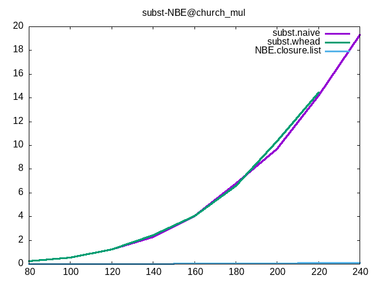

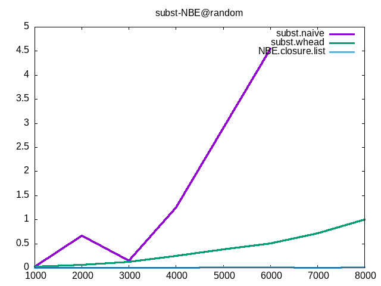

### NBE variants
Different variants of the untyped NBE algorithm is compared.
Note that since the call-by-value abstract machine `AM.Crégut.CBV`
has essentially the same runtime behavior as untyped NBE
(I conjecture so, this can perhaps be proved via some distillation),
it is tested here too.

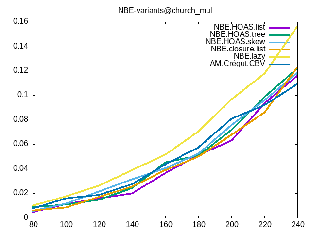

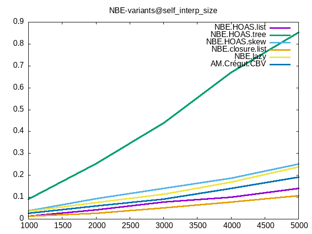

### DBI v.s. named
`NBE.closure.list` is compared against two normalizers
using term with named variable instead of de Brujin index.
These two normalizers use association list and AVL tree to represent
environment in respect:

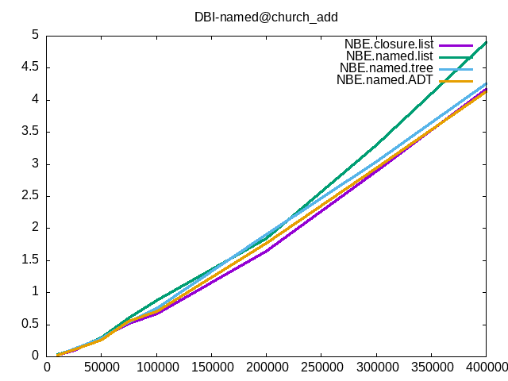

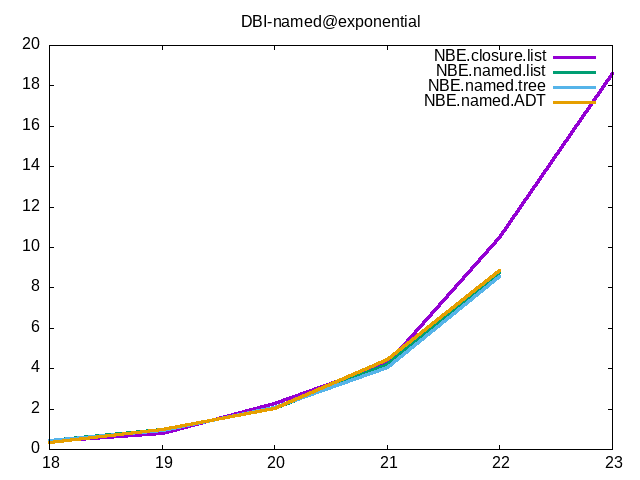
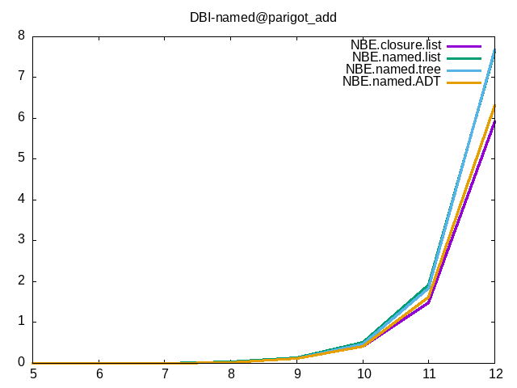
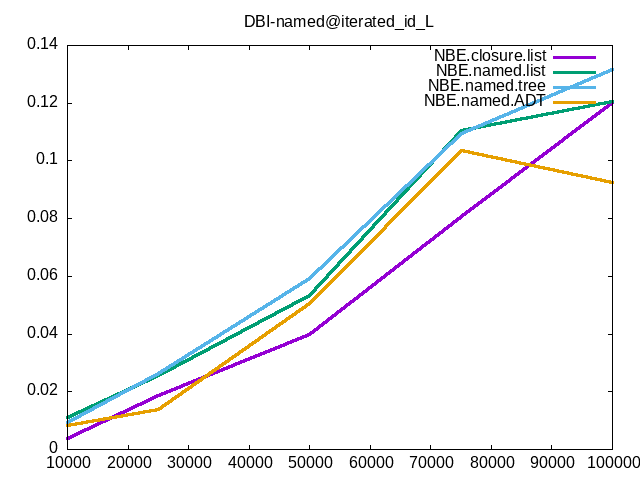

### abstract machine variants
Three variants of the CBN strongly reducin Krivine machine is tested.
The difference lies in the use of different data structures
to represent the control stack.

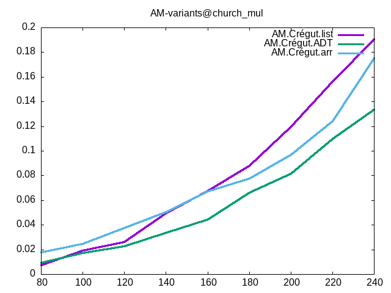
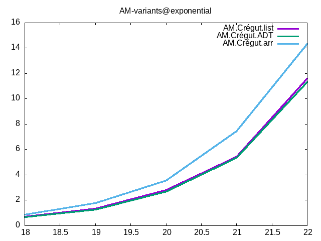
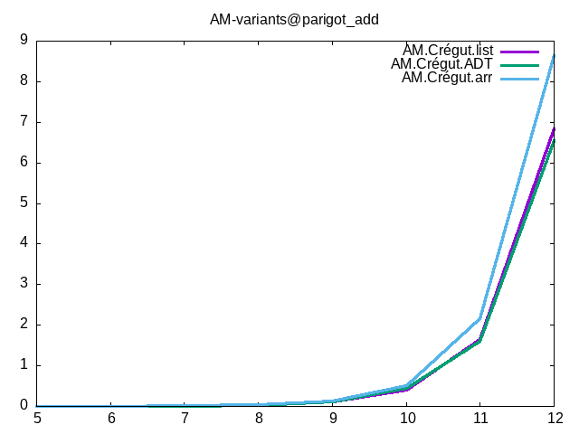

## memorized NBE
Three variants of NBE with memorization for the quoted term is tested,
compared against `NBE.closure.list`.
See the conclusion part for more details on this three variants.

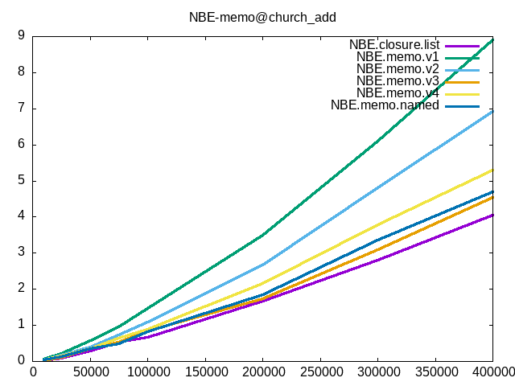
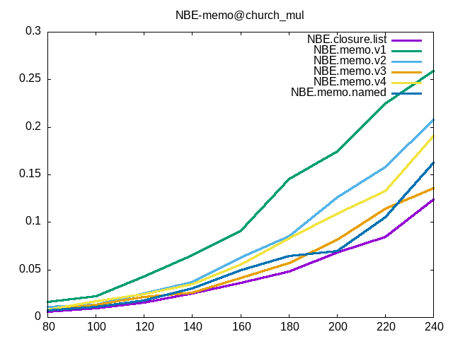
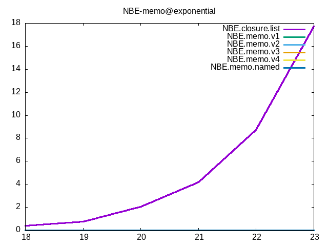
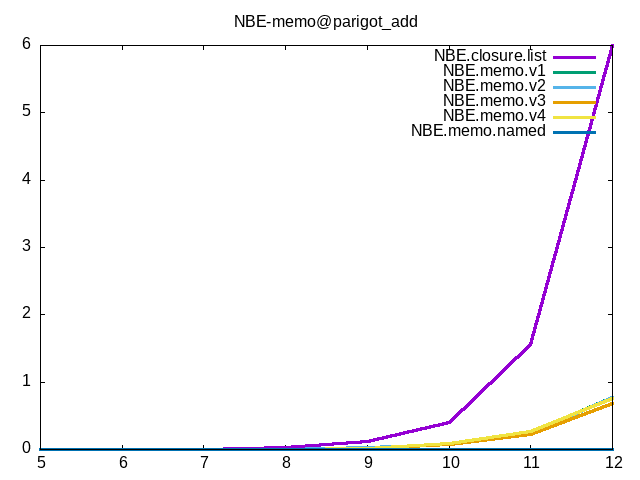
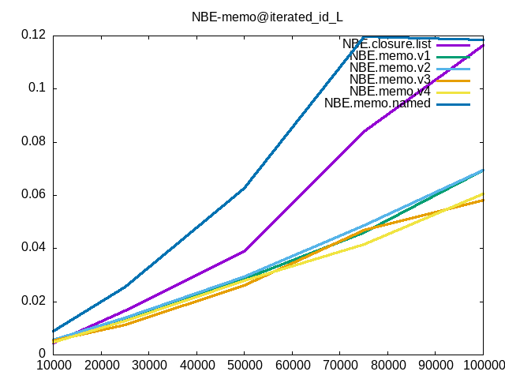

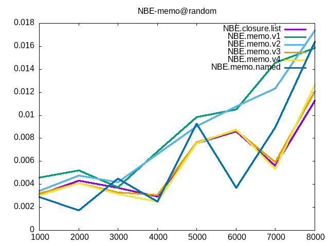

## compiled NBE
Variants of untyped NBE implemented via compilation to OCaml is tested here.
UTLC terms are compiled to OCaml terms using some tagged HOAS.
In essence, the OCaml compiler is reused to derive a bytecode/native normalizer.
Since compilation time is very long,
benchmarks with large initial term sizes are not tested here.

The time for normalization is as follows
(note that the 20 second timeout applies to normalization time + compilation time,
so some lines may cut off early):

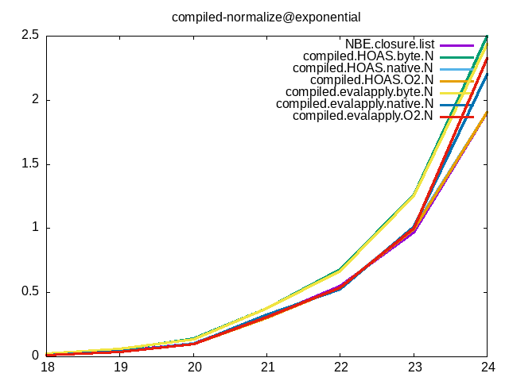

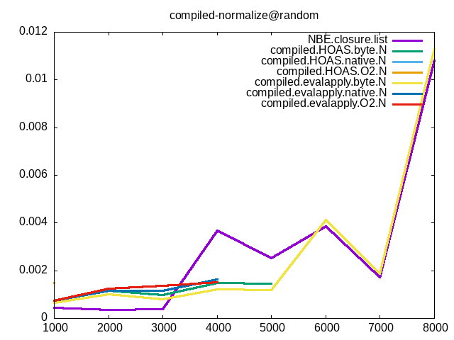

The time for compilation to OCaml (generate source code + compile source code)
is as follows:

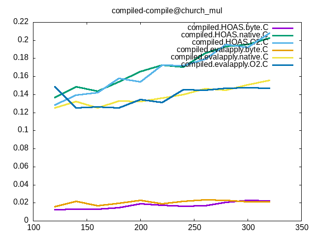
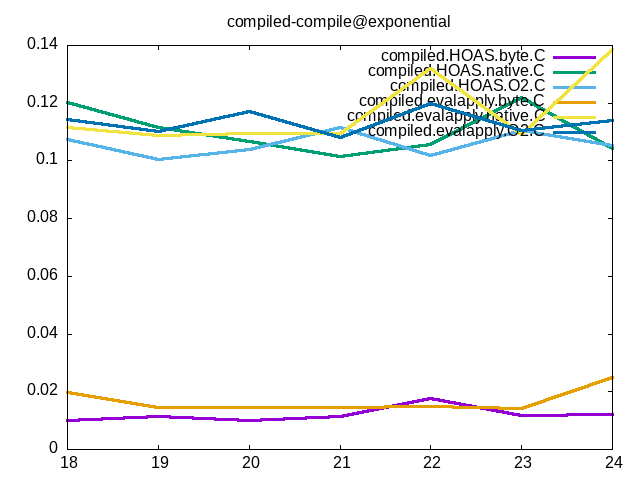
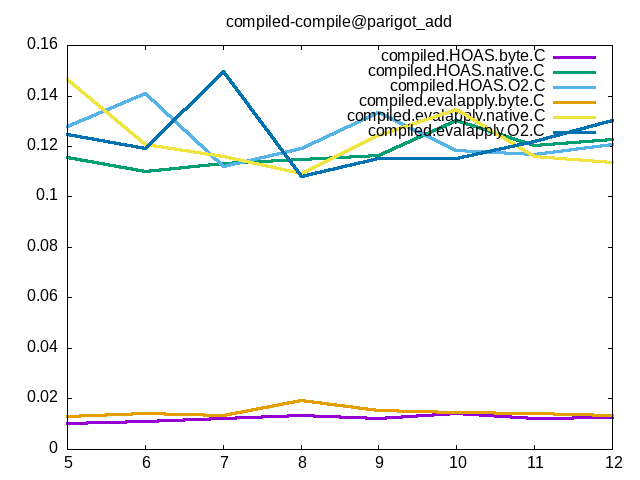

## Conclusion

### The imprecision of the results here
Before proceeding with drawing my personal conclusion,
it must be mentioned first that the result here suffers from various
imprecision, and some may has a significnat effect.

First of all, the effect of the host system is not isolated.
The results above is tested on a laptop with GUI, etc. running.
All the benchmarks use only one core,
and the system load is kept low while benchmarking.
Nevertheless, the status of the system may still has an effect on the result.

Second, the effect of OCaml GC is not measured or tuned.
This is perhaps the most vital problem of all the results here.
To understand the reason behind the performance differences
of different normalizers on different benchmarks,
The amount of time spent on GC should really be measured.

Third, as will be mentioned in detail later,
the benchmarks here cannot represent the realworld workload
of a normalization algorithm in type system implementations.
For example, all benchmarks here are standalone lambda terms,
while in practice calling defined functions is much, much more common.

Given all these imprecisions,
the result and conclusion here is **not solid at all**.
However, I think some of the results here,
in particular the very significant differences in performances,
are to some extent trustworthy.
Also, while imprecise,
I think the result here may shed some light on further investigations,
where more precise, more detailed experiments
on a smaller number of normalizers are carried out.

### subst v.s. NBE
Unsurprisingly, NBE outperforms CAS by orders of magnitude.
IMO the reason behind is that CAS creates too many intermediate terms
during substitution,
while NBE avoid these unnecessary allocations altogether
by passing an environment,
deferring and merging substitutions.

Surprisingly, CAS does outperform NBE is one benchmark: `iterated_id_L`.
This is probably due to this benchmark being so simple that CAS introduces
no overhead,
while NBE suffers from a constant overhead due to closure allocation.

### NBE variants
The various different NBE variants have very similar performance:
the difference is much smaller than that between NBE and CAS.
However, some small but stable difference can still be observed.

Let's first focus on the representation of environment.
Comparing `NBE.HOAS.list|tree|skew`,
one find that, surprisingly, `list` is always the most performant.
For some `church_add|mul`, `exponetial`, `iterated_id_L|R`,
the enviroment is always very shallow, so this result makes sense.
But the difference persists in `parigot_add`, `random` and `self_interp_size`.
My interpretation of this result is:

- adding new entries to the environment is a very common operation.
So the `log(N)` cost of `tree`, or even the constant overhead of `skew`
has a significant effect.
- environment lookup is also a very common operation,
but for shallow environments
(which IMO is also the most common case in practice,
if defined variables are stored separatedly),
the `O(N)` cost of `list` is not that terrible,
and the constant overhead of `tree` and `skew` is not negligible.

Next, let's focus on `HOAS` v.s. `closure`.
The difference is small and alternating,
The runtime behavior of using HOAS and using closure is actually almost identical.
If any difference exists at all it would probably lie in
the pervasive existence of indirect function calls in `HOAS`.
I think it is fine to consider the two equally performant in practice.

Next, let's look at the lazy varinat `NBE.lazy`.
In the benchmark here it is outperformed by its strict companions.
Of course, this may be due to the characteristic of the benchmarks here.
And a runtime system with better support for laziness, such as GHC,
may make a difference too.

Finally, `AM.Crégut.CBV`,
while conjectured having the same runtime behavior as untyped NBE,
has a stable constant overhead.
IMO this overhead can be seen as an instance of
stack-allocated activation record (untyped NBE)
v.s. heap-allocated activation record (abstract machine),
as the abstract machine is always tail recursive,
and evaluation context is heap allocated using ADT.

A bytecode version of the abstract machine would be very interesting.
But this strongly reducing machine seems more difficult to "bytecode-ize"
than weak machines
(for example, Coq's bytecode VM is a weak reduction machine
with additional support for open terms).
I think investigating in this direction would be very interesting.

### DBI v.s. named
From the results,
de Brujin index is slightly faster than named terms.
This is probably due to caused by faster environment lookup.
Under the conjecture that
"recently defined bound variables are accessed most frequently",
DBI may need less steps on average to lookup bound variables.
`List.nth` is also faster than `List.assoc` in terms of constant overhead.

When using named term representation,
linked list is still more performant than balanced trees.
This is probably due to smaller constant overhead
and better complexity on insertion.
Again, the length of the environment of bound variables is small in the benchmarks here.
So the setting of the benchmarks may be unfair to balanced trees.
But in practice, the number of bound variables is usually small, too.

Inlining pairs in association list should in theory reduces
some indirectons when looking up variables.
And the results shows that it indeed brings some slight boost.
This is in agreement with the results of abstract machine variants below.

### abstract machine variants
The three tested abstract machine variants are CBN,
strongly reducing Krivine machine.
Since they are CBN, they are not intended to be used in practice.
However, I think the result here scale to other abstract machines,
such as the strongly reducing CBV machine above.

Before looking at the performance of the results,
I would like to first explain the details of the three abstract machines.
All three abstract machines are the CBN, strongly reducing Krivine machine.
This abstract machine contains three components,
a code representing current control,
an environment for bound variables that may be captured,
and a global stack holding continuations.
The environment is represented as lists in all three machines.
The difference lies in the representation of the continuation stack.
In `AM.Crégut.list`, it is represented as a list of continuations.
In `AM.Crégut.arr`, it is represented as a large, fixed size array of continuations.
In `AM.Crégut.ADT`, it is represented as a ADT,
with the "tail" part of the continuation stack inlined into every type of continuation.

Now, the access pattern on the stack during the execution of the abstract machine
is also worth mentioning.
Basically, the machine will look at the first frame in the continuation
stack (or its absence) on every transition,
and decide its behavior accordingly.

With the above information in mind,
it is now easy to see why `ADT` is the most performant in most cases.
In `list`, each transition requires inspecting whether the list is empty
(one indirection) + inspecting the first frame of the stack when it is present
(one indirection).
In `arr`, each transition requires a bound check plus one indirection
inspecting the first stack frame.
Finally, in `ADT`, all these can be done by inspecting the ADT
(one indirection).

Given that the above operation must be repeated on every machine transition,
I think the ADT implementation of stack
should be favored for abstract machine based normalizers.

### memorized NBE
Three variants of untyped NBE with memorization is tested here,
compared against `NBE.closure.list`.
The evaluation part of the NBE algorithms is unchanged.
However, each value additionally memorizes the term it quotes back to.
So during the quoting phase of NBE,
some quotations may be avoided by memorization.

Since terms are represented using DBI,
the same value quotes to different terms under different levels.
So the cached term will hit only when its level is equal to the requested
level.
To avoid overly large space and time overhead,
here each value only holds one memorization slot.
When a cache miss happens (i.e. requested level different from cached level),
the actual quoting algorithm must be run,
and the result together with the new value is memorized.

This memorization will work, largely because the evaluation phase
already performs a lot of sharing.
Consider the term `(\x. x x) M`, it will reduces to `M M` if `M` is neutral.
However, the two `M`s are actually shared,
since the evaluation phase does not copy values when extracting them from the environment.
So the memory representation of values in NBE is already a acyclic graph with sharing,
and the memorization simply make use of this sharing to avoid repeated computations.

The benchmarks in this combination can be divided into two parts:
`exponential` and `parigot_add` have a lot of term sharing in their results.
The size of the result would be exponential if no sharing is performed.
Unsurprisingly, the algorithms with memorizations is orders of magnitude faster
in these two benchmarks.

The rest of the benchmarks don't have such pervasive sharing,
and can be seen as a test of the overhead of memorization.
Before inspecting the result,
let's first discuss the difference between `v1`, `v2`, `v3` and `v4` of the memorized algorithms.
The three differs only in the representation of values:

    (* v1 *)
    type value1 =
        { rep : value1_rep
        ; mutable syn : (int * term) option }

    and value1_rep =
        | VLvl of int
        | VLam of (value1 list * term)
        | VApp of value1 * value1

    (* v2 *)
    (* When there's no cache available,
      [lvl = -1] and [syn] holds some garbage value *)
    type value2 =
        { rep         : value2_rep
        ; mutable lvl : int
        ; mutable syn : term }

    and value2_rep =
        | VLvl of int
        | VLam of (value2 list * term)
        | VApp of value2 * value2

    (* v3 *)
    (* When there's no cache available,
      [lvl = -1] and [syn] holds some garbage value *)
    type value3 =
        | VLvl of
              { mutable lvl : int
              ; mutable syn : term
              ; value       : int }
        | VLam of
              { mutable lvl : int
              ; mutable syn : term
              ; env         : value3 list
              ; body        : term }
        | VApp of
              { mutable lvl : int
              ; mutable syn : term
              ; func        : value3
              ; arg         : value3 }
              
    (* v4 *)
    (* When there's no cache available,
      [lvl = -1] and [syn] holds some garbage value *)
    type value4 =
        | VLvl of int (* leaf nodes not cached *)
        | VLam of
              { mutable lvl : int
              ; mutable syn : term
              ; env         : value4 list
              ; body        : term }
        | VApp of
              { mutable lvl : int
              ; mutable syn : term
              ; func        : value4
              ; arg         : value4 }

The three are equivalent in terms of functionality.
However, in OCaml, all records and ADT with extra data is stored as blocks,
which means a level of indirection.
So in `v1`, the access pattern on values is:

1. fetch the record `value`, one indirection
1. inspect the cache stored in `option`, one more indirection
1. on cache miss, inspect `value1_rep`, one more indirection

In `v2`, the access pattern is:

1. fetch the record `value2`, one indirection
1. inspect the cache, no indirection since it is stored in `value2` directly
1. on cache miss, inspect `value2_rep`, one indirection

In `v3` and `v4` (take `v3` as an example), the access pattern is:

1. inspect `value3` and fetch attached data, one indirection
1. inspect the cache, no indirection since it is stored in each branch
of `value3` directly
1. on cache miss, perform normal quoting, no indirection
since `value3` is already inspected

So counting the number of indirections when accessing a value on quoting,
the result is `v3 = v4 (1) < v2(1 ~ 2) < v1(2 ~ 3)`.
And this is in exactly agreement with the actual time consumed by these algorithms.
`v3` is always the fasted, `v1` is always the slowest, with `v2` in the middle.

From the results, `v1` and `v2` has a significant constant overhead
compared to `NBE.closure.list`.
Given that terms with tons of sharing is not very common in practice,
this makes them much less attractive.
However, `v3`, with its optimized data layout,
has a very small constant overhead compared to `NBE.closure.list`.
Now its dramatic speedup in extreme cases become much more attractive.

Next, let's compare `v3` and `v4`.
`v3` is faster than `v4` in general,
this indicate that caching leaf nodes can actually improve performance,
although it seems to require more work (maintaining the cache)
when processing leaf nodes.
I think `v4` is slower because it requires more allocation:
the leaf nodes are not shared.
This may also indicate that allocation
accounts for a significant part of the total time consumed.

### compiled NBE
Normalizers derived by reusing the OCaml compiler is tested here.
Note that the benchmarks here is really unfair to these normalizers,
because one very important optimization, known function call,
has on effect at all in the benchmarks here.
However, the result can still be seen as a measure of performance
on plain lambda terms of a bytecode or native code compilation normalizer.

In these normalizers, lambda terms are compiled to OCaml terms
using HOAS, and lambdas are compiled to OCaml functions.
In the `compiled.evalappl.*` normalizers,
instead of currying all functions,
specialized constructors for functions of arity 1 to 5,
as well as specialized application functions of arity 1 to 5,
is defined.
In the multi-ary constructors, native n-ary functions of OCaml is used.

First, let's look at normalization speed.
Surprisingly, `NBE.closure.list` is outperforms bytecode normalizers,
and has similar or even sometimes better performance compared to native normalizers.
This may reveals that traversing source term during evaluation is not a performance critical part of NBE,
instead calling functions is.
So `NBE.closure.list`, being natively compiled itself,
outperforms bytecode compilation and is comparable to native code compilation.
Also, O2 optimization seems irrelevant on the generated OCaml source code.
This is reasonable, as the generated code has very simple structure
and little room for optimization.
The difference of the `evalapply` optimization seems small,
but this is very likely due to the characteristic of the benchmarks here.
The benchmark that will most likely favor `evalapply`, `random`,
fail to give enough data due to overly long compilation time.

Next, let's look at the compilation speed.
Unsurprisingly, bytecode compilation is much faster than native code compilation.
The O2 switch has no effect on compilation time,
perhaps because there's nothing to optimize during compilation.
Surprisingly, the `evalapply` optimization has a significant effect on compilation speed.
In the `random` benchmark,
which has the most multi-ary application,
this difference is very obvious.

I would consider the approach of reusing the OCaml compiler,
or any other existing compiler impractical,
due to the long compilation time.
Directly generating OCaml bytecode or typed AST may be better,
as unnecessary parsing and type checking can be avoided,
and would be very interesting to investigate.
However, such approach also makes implementation harder.

### Personal thoughts on choice of normalizer
Normalization is one of the most important parts of a dependent type checker.
So which normalizer to choose for your next dependently typed language?

Some type theories, such as the Cubical Type Theory,
don't have known NBE algorithms.
For these theories, CAS is perhaps the only choice.
However, as the results above shows, CAS is ordes of magnitude slower than NBE.
So a NBE algorithm is highly desirable for any implementation
with type checking efficiency under concern.

In fortunate cases where a NBE algorithm is available,
the result above shows that plain untyped NBE is already blazing fast.
`NBE.closure.list` is among the fastest in almost all benchmarks,
beaten only on some extreme cases (`exponential` and `parigot_add`).
So I think plain untyped NBE is already good enough for most cases,
and there's no need for a very complex algorithm.

However, in some cases where heavy proof-by-reflection is used,
such as the proof of the four color theorem, untyped NBE may be inadequate.
In this case, more sophiscated compilation scheme,
to bytecode or nativecode, may be more desirable.
However, the overly long compilation time renders these efficient approaches
impractical for most everyday type checking,
where the amount of computation is small but term sizes are large.

In turns of optimizing untyped NBE,
data layout in memory seems to have a very significant effect.
This is not unexpected,
as most of the time spent in NBE is manipulating values and terms,
and one less indirection means more performance.
This can be observed from the benchmarks of
NBE with different environment representation,
different value layouts of memorized NBE,
and different stack representations of strongly reducing abstract machine.

In spite of the efficiency of `NBE.closure.list`,
some normalizers do have unique characteristics that may be desirable.
For example `NBE.memo` in `exponential` and `parigot_add`.
Besides, abstract machine based approaches, such as `AM.Crégut.CBV`,
allows the easy integration of a notion of "budget" for evaluation.
This can be useful for non-terminating type theories,
where the type checker can abort after certain number of transitions
instead of looping forever.

Finally, given that the simplest NBE algorithm is already so fast,
I wonder if the bottle neck of dependent type checking lies somewhere else,
for example in meta solving and unification.
Also, the effect of representation of global definitions is not considered
in this benchmark.
Further investigation on the factors behind the performance of
dependent type checking is definitely a very interesting topic.

## References

<a id="1">[1]</a>
<https://oa.upm.es/30153/1/30153nogueiraINVES_MEM_2013.pdf>

<a id="2">[2]</a>
<https://dl.acm.org/doi/10.1007/s10990-007-9015-z>

<a id="3">[3]</a>
<https://hal.inria.fr/hal-01499941/document>

<a id="4">[4]</a>
<https://www.ccs.neu.edu/home/wand/papers/shivers-wand-10.pdf>

<a id="5">[5]</a>
<https://dl.acm.org/doi/book/10.5555/868417>

<a id="6">[6]</a>
<http://citeseerx.ist.psu.edu/viewdoc/summary?doi=10.1.1.95.2624>

<a id="7">[7]</a>
<https://link.springer.com/chapter/10.1007/3-540-52753-2_47?noAccess=true>

<a id="8">[8]</a>
<https://homepage.cs.uiowa.edu/~astump/papers/cedille-draft.pdf>

<a id="9">[9]</a>
<https://dl.acm.org/doi/10.5555/580840>

<a id="10">[10]</a>
<https://www21.in.tum.de/~nipkow/pubs/tphols08.pdf>

<a id="11">[11]</a>
<https://hal.inria.fr/hal-00650940/document>

<a id="12">[12]</a>
<https://hal.inria.fr/inria-00434283/document>

<a id="13">[13]</a>
<https://arxiv.org/pdf/1701.08186.pdf>
